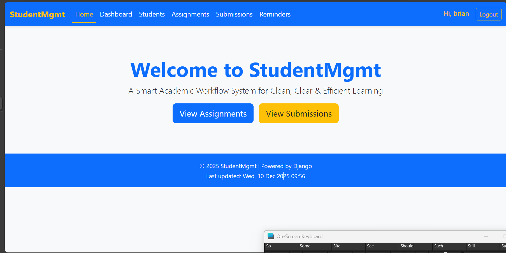
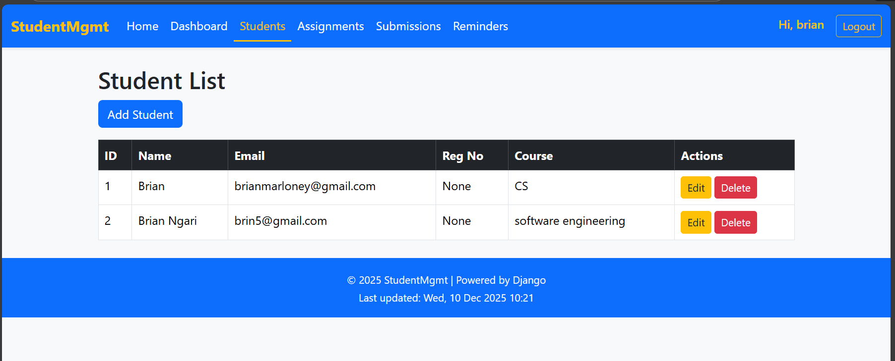
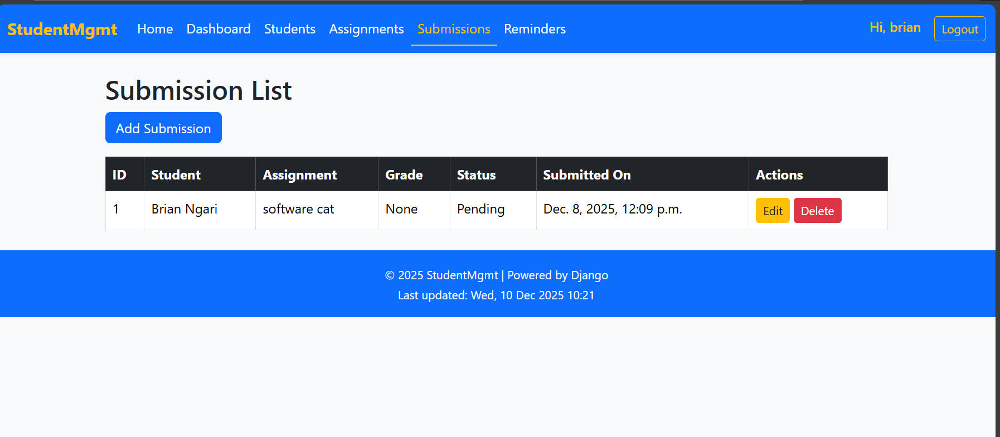

# Student Management System

A Django-based web application for managing students, assignments, and reminders.

## 🚀 Features
- Student CRUD (Create, Read, Update, Delete)
- Assignment tracking
- Reminder system with due dates
- Role-based access

## 🛠 Tech Stack
- Python 3.x
- Django 5.x
- Bootstrap 5
- SQLite (default, can switch to MySQL/PostgreSQL)

## ⚙️ Setup Instructions
```bash
git clone https://github.com/Mason-hun/studentmgmt.git
cd studentmgmt
pip install -r requirements.txt
python manage.py migrate
python manage.py runserver




👨‍💻 Author
Brian Ngari — Computer Science student at Kisii University, aspiring web developer.
